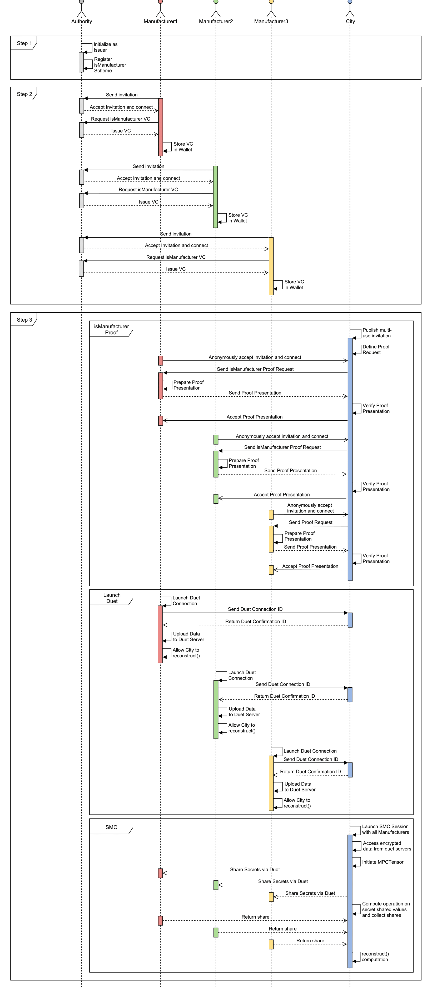

# Aries ACA-Py and OpenMined SyMPC Demo

**What:** This repository is the basis of a master thesis to demonstrate and validate how Aries ACA-Py for self-sovereign identity (SSI) and PySyft's extension SyMPC for secure multiparty computation (SMC) can be combined to enable sovereign data exchange. 
Specifically, the use cases designs, describes, and implements actors and interactions involving verifiable credential (VC) exchange of information in the context of vehicle emission data.

**How:** The project uses Docker and docker-compose to support and simplify the arbitrary configuration of actors within a SSI ecosystem. 
The business logic of the individual agents (i.e., how they interact with one another) is implemented through Jupyter notebook interfaces. 
The Jupyter notebooks use the aries-cloudcontroller to interface with the actors respective ACA-Py agent. 
Either by sending API requests to their exposed Swagger-API or receiving events from this agent posted to a webhook server that is run within the notebooks.

**Why:** Demonstrate the implementation of a sovereign data exchange use case.

**Note:** The repository was forked from the [Aries-Jupyter Playground](https://github.com/wip-abramson/aries-jupyter-playground) as a basis to develop the use case.


## Sovereign Data Exchange Use Case: Trading Vehicle Emission Data

The use case concerns the sharing of emission data. A city municipality wants to know how much CO2 is emitted by vehicles in road traffic over time. 
The city (i.e., data consumer) approaches car manufacturers (i.e., data providers) and asks whether the manufacturers are willing to share the 
emission data of their vehicles. The city outlines a set of conditions the car manufacturers should fulfill for the use case:

1. The emission data should be as exact as possible (geolocation and timestamp).
2. The manufacturers can certify the validity of shared emission data. 

The manufacturers would like to support the city, but are afraid to lose a competitive advantage, reveal sensitive emission data, or face reputation losses (Zöll, Olt, and Buxmann, 2021). Thus, the participating manufacturers define a set of conditions:
1. The city and participating manufacturers remain unaware of how much total CO2 was emitted by one manufacturer.
2. The exact number of vehicles and CO2emission per vehicle remains unknown to third parties.
3. The personal data (i.e., timestamp and coordinates) of car drivers who consent to data collection is anonymized.
4. The city only uses the shared emission data for the outlined purpose.

## Project architecture




## Getting started

### Requirements

This project is written in Python and is displayed in jupyter notebooks.

You need to install:
1. [Docker](https://docs.docker.com/get-docker/)
2. [docker-compose](https://docs.docker.com/compose/install/)
3. The **source-to-image** (s2i) tool is also required to build the docker images used in the demo. S2I can be downloaded [here](https://github.com/openshift/source-to-image). The website gives instructions for installing on other platforms like MACOS, Linux, Windows.
Verify that **s2i** is in your PATH.  If not, then edit your PATH and add the directory where **s2i** is installed.  The **manage** script will look for the **s2i** executable on your PATH.  If it is not found you will get a message asking you to download and set it on your PATH.
    - If you are using a Mac and have Homebrew installed, the following command will install s2i: `brew install source-to-image`
    - If you are using Linux, go to the [releases](https://github.com/openshift/source-to-image/releases/latest) page and download the correct distribution for your machine. Choose either the linux-386 or the linux-amd64 links for 32 and 64-bit, respectively. Unpack the downloaded tar with `tar -xvf "Release.tar.gz"`
    - If you are not sure about your Operating System you can visit [this](https://whatsmyos.com/) and/or follow the instructions.
    - You should now see an executable called s2i. Either add the location of s2i to your PATH environment variable, or move it to a pre-existing directory in your PATH. For example, `sudo cp /path/to/s2i /usr/local/bin` will work with most setups. You can test it using `s2i version`.

Ensure that Docker is running. If it is not try `sudo dockerd` in another terminal.

### Running the Use Case

This playground comes with five agents that interact with one another: 
* Authority 🏛
* City 🏙️
* Manufacturer1 🚗
* Manufacturer2 🚛
* Manufacturer3 🛵

Each agent has four containers: 
* Aries Agent Container: `<agent-name>-agent`
* Wallet PostgresDB: `<agent-name>-wallet-db`
* Ngrok: `ngrok-<agent-name>`
* Jupyter Lab: `<agent-name>-business-logic`

The interface to access the business logic of each agent is managed through the Notebooks in the Jupyter Lab container. 
The containers are configured in `docker-compose.yml` and the respective `agents/<agent-name>/.env` files. 
(See [this](https://github.com/hyperledger/aries-cloudagent-python/blob/main/aries_cloudagent/config/argparse.py) file to understand the variables in the `.env` files.)
All actors use the indy network Sovrin StagingNet to write and resolve cryptographic objects to and from (see `ACA_PY_GENESIS_URL` variable in `.env` files).

Please execute the following instructions to run the Use Case:
1. Before you can launch the Use Case, you must set the .env file for each of agent. For a quick start, copy the files `playground/<agent-name>/<agent-name>_example.env` and rename them to `playground/<agent-file>/.env`.
2. Move to the `./SyMPC` directory and clone the [SyMPC](https://github.com/OpenMined/SyMPC) repository. The SyMPC package is created by the OpenMined organization, and an extension of the [PySyft](https://github.com/OpenMined/PySyft) library, and automatically installs PySyft (which is needed for this Use Case). 
3. Run: `./manage.sh start`. This spins up all docker containers defined in the `docker-compose.yml` file and named in the DEFAULT_CONTAINERS variable defined in the `manage.sh` shell script. 
4. Retrieve the URLs for each agent's jupyter notebook (business logic) by running `./scripts/get_URLS.sh` in a terminal from the root of this project.
5. Run the use case's demo (parallel to the steps in the sequence diagram)
   1. Open the authority's jupyter notebook. Then, execute Notebook `01_init_authority_as_issuer.ipynb`
   2. Open the manufacturers' jupyter notebooks. Then, execute the authority's and manufacturers' notebooks starting with `02_`
   3. Open the city's jupyter notebook. Then, proceed with the city's and manufacturers' notebooks `03_` 

To stop the docker containers run either of the two commands:
* `./manage.sh stop` - this terminates the containers but persists the volumes. Specifically the agent wallet storage held in postgres-db's
* `./manage.sh down` - terminate containers and delete all volumes (e.g., the issued VCs stored in an agent's wallet)

**Note:** An error when spinning the docker containers might be `Service '<docker-container>' failed to build : Build failed`. A possible solution is to up the Memory available to docker to 3GB (see [StackOverflow post](https://stackoverflow.com/questions/44533319/how-to-assign-more-memory-to-docker-container)).


### Potential Error Messages
There is a chance you run into certain error messages. Here is a list of how to deal with a few of them: 

#### Error 1: Non-responsive agents
In some cases, the agents fail to connect with one another. If too many connection requests are made, a `402` error appears in the Docker logs of one of the agents:
```
aries_cloudagent.transport.outbound.manager ERROR >>> Error when posting to: https://682ea719f54a.ngrok.io; Error: (<class 'aries_cloudagent.transport.outbound.base.OutboundTransportError'>, OutboundTransportError('Unexpected response status 402, caused by: Payment Required',), <traceback object at 0x7fe0d157d788>); Re-queue failed message ...
```
The error asks the user to provide Payment for the ngrok service. A solution is to stop the docker containers through `./manage.sh stop` and restarting them `./manage.sh start`.

#### Error 2: Proxy Settings

* See [this Medium article](https://airman604.medium.com/getting-docker-to-work-with-a-proxy-server-fadec841194e) with information on how to set up a proxy for docker-compose
* Frequent error when building the docker containers: `Service '<docker-container>' failed to build : Build failed`. Try to increase the memory available memory to 3GB (see [StackOverflow post](https://stackoverflow.com/questions/44533319/how-to-assign-more-memory-to-docker-container)
